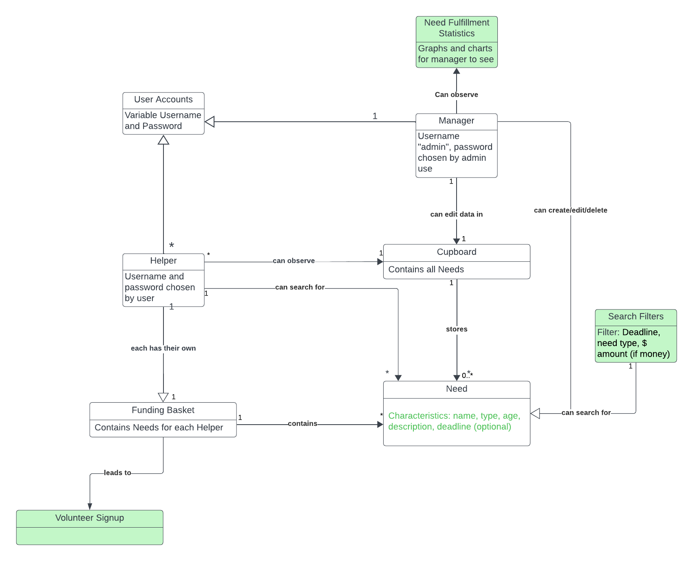
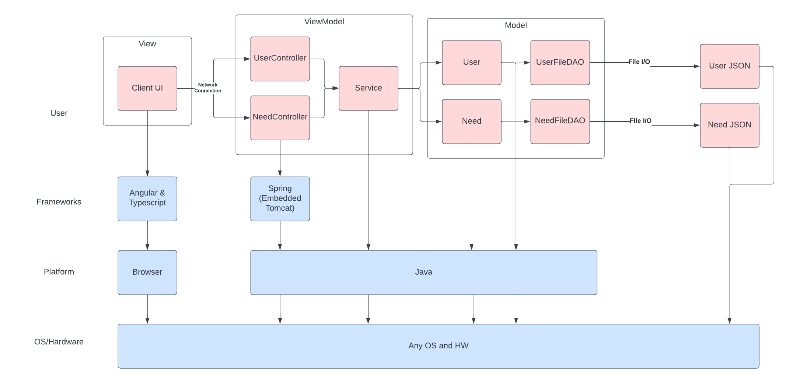
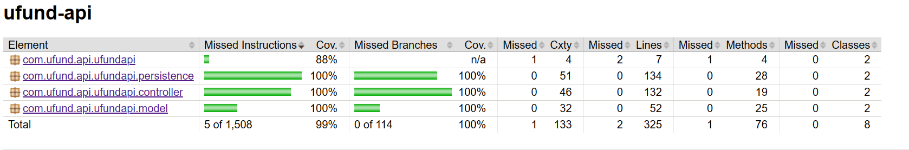

# PROJECT Design Documentation

> _The following template provides the headings for your Design
> Documentation.  As you edit each section make sure you remove these
> commentary 'blockquotes'; the lines that start with a > character
> and appear in the generated PDF in italics but do so only **after** all team members agree that the requirements for that section and current Sprint have been met. **Do not** delete future Sprint expectations._

## Team Information
* Team name: Julian and The Maurices
* Team members:
  * Julian Alvia
  * Matthew Zobbi
  * Shaher Naser
  * Alexander DiMartino
  * Brandon Santore

## Executive Summary

### Purpose
>  _**[Sprint 2 & 4]** Provide a very brief statement about the project and the most
> important user group and user goals._

For this project, we intend to build a system that can function as an adminstrative aid for any organization looking to have a robust, easily scalable mechanism to curate and assign tasks or other requirements that need to be fulfilled.

### Glossary and Acronyms
> _**[Sprint 2 & 4]** Provide a table of terms and acronyms._

| Term | Definition |
|------|------------|
| SPA | Single Page Application |
| MVP | Minimum Viable Product |
| Helper | An individual who has access to a basket and can volunteer to fulfill needs. |
| Adminstrator | An individual who curates the list of needs for all helpers. |

## Requirements

> _In this section you do not need to be exhaustive and list every
> story.  Focus on top-level features from the Vision document and
> maybe Epics and critical Stories._

### Definition of MVP

For our MVP, each user, as a voluteer for the U-fund, should be able to browse, search for, and contribute to any desire number of needs. This is accomplished by adding needs to a "funding basket" that they can add and remove needs from. The list of needs is set up and curated by an administrator user, who can also edit the name, description, type, and target quantity of all needs. However, the adminstrator cannot view the funding baskets of any user. User and adminstrators login via a login page, and the adminstrator logs in with the username "admin." Any other username/password combonation is assumed to be a user.

### MVP Features

>  _**[Sprint 4]** Provide a list of top-level Epics and/or Stories of the MVP._

### Enhancements

> _**[Sprint 4]** Describe what enhancements you have implemented for the project._

## Application Domain

> _**[Sprint 2 & 4]** Provide a high-level overview of the domain for this application. You
> can discuss the more important domain entities and their relationship
> to each other._

## Architecture and Design

### Summary

The following Tiers/Layers model shows a high-level view of the webapp's architecture. Detailed diagrams are in later sections of this document.

The web application is built using the Model–View–ViewModel (MVVM) architecture pattern. 

The Model stores the application data objects including any functionality to provide persistance. 

The View is the client-side SPA built with Angular utilizing HTML, CSS and TypeScript. The ViewModel provides RESTful APIs to the client (View) as well as any logic required to manipulate the data objects from the Model.

Both the ViewModel and Model are built using Java and Spring Framework. Details of the components within these tiers are supplied below.

### Overview of User Interface

When a helper first opens the application, they are presented with the log in page, with the option to sign up or log in. If it is the user's first time using the application, they sign up using a username and password of their choosing; if the user already has an account, they click the "log in" button instead to log in to their existing account. Either option then presents a helper with the list of all needs in the database, with a link to a search bar at the top and a link to view their basket. By clicking on a need, the user can view details about the need, such as its description and how much it needs to be fulfilled, and they can also choose to add it to their basket and choose how much they want to contribute to it. In the helper's basket, they are presented with a list of all needs in their basket, as well as having the option to remove any need from their basket. They also have the option to check out all of the needs in their basket, contributing their desired amount to all of them. By clicking on the search link, the user is presented with a search box where they can searh for needs by title. An administrator has different options compared to a regular user. After they log in using the username "admin", they are presented with the same list of all needs in the database with the search bar at the top. However, there is no link to a user basket. As an administrator, they can also click on any need in the list to both view and edit the name, description, type, and target quantity of any need in the database, and update it to reflect those changes.

### View Tier

> _**[Sprint 4]** Provide a summary of the View Tier UI of your architecture.
> Describe the types of components in the tier and describe their
> responsibilities.  This should be a narrative description, i.e. it has
> a flow or "story line" that the reader can follow._

> _**[Sprint 4]** You must  provide at least **2 sequence diagrams** as is relevant to a particular aspects 
> of the design that you are describing.  (**For example**, in a shopping experience application you might create a 
> sequence diagram of a customer searching for an item and adding to their cart.)
> As these can span multiple tiers, be sure to include an relevant HTTP requests from the client-side to the server-side 
> to help illustrate the end-to-end flow._

> _**[Sprint 4]** To adequately show your system, you will need to present the **class diagrams** where relevant in your design. Some additional tips:_
 >* _Class diagrams only apply to the **ViewModel** and **Model** Tier_
>* _A single class diagram of the entire system will not be effective. You may start with one, but will be need to break it down into smaller sections to account for requirements of each of the Tier static models below._
 >* _Correct labeling of relationships with proper notation for the relationship type, multiplicities, and navigation information will be important._
 >* _Include other details such as attributes and method signatures that you think are needed to support the level of detail in your discussion._

### ViewModel Tier

The primary ViewModel is the "NeedController". This class is responsible for the functions the user must be able to utilize from the View tier. The functions currently within "NeedController" are:
updateNeed() - To update the information of a specified need
createNeed() - To create a new need
getNeeds() - To return a list of needs
getNeed() - To return an individual need
deleteNeed() - To remove an individual need
searchNeeds() - To navigate the user's list of needs

These functions will be called in the View tier of the project, and will communicate with the View tier to display information to the user.

> _**[Sprint 4]** Provide a summary of this tier of your architecture. This
> section will follow the same instructions that are given for the View
> Tier above._

> _At appropriate places as part of this narrative provide **one** or more updated and **properly labeled**
> static models (UML class diagrams) with some details such as critical attributes and methods._
> 

### Model Tier

At this stage of the project, the primary models are the "Need" and "NeedFileDAO".
The "Need" class represents a user's need, and contains methods for getting information from a need, and modifying the contents of a need.

The "NeedFileDAO" class contains the code utilized by the ViewModel tier of the project. The methods contained in this class are:
getNeedsArray() - To search an array of needs given specific criteria
updateNeed() - To update the information of a specified need
createNeed() - To create a new need
getNeeds() - To return a list of needs
getNeed() - To return an individual need
deleteNeed() - To remove an individual need

The "NeedFileDAO" class is the backend of the project, and interfaces with the ViewModel tier to allow the user to modify and access needs. 

As of the end of Sprint 2, we have added a User class to the model tier, and an associated UserFileDAO to the persistence class. The User class is used to represent any user who uses our software. It contains information, such as, the user's login information and the user's funding basket of needs.

The User class also contains these methods:
getUsername() - Returns the user's username
getPassword() - Returns the user's password
getNeeds() - Returns a list of needs in the user's funding basket
getContributions() - Returns a list of contributions the user is making to each need
isAdmin() - Checks to see if a user is logged in as admin
isPassword() - Checks to see if the password input matches the user's password
addNeed() - Adds a need and contribution to that need to the user's funding basket
removeNeed() - Removes a need and contribution to that need from the user's funding basket
clearBasket() - Clears the user's funding basket of all needs and contributions

> _**[Sprint 2, 3 & 4]** Provide a summary of this tier of your architecture. This
> section will follow the same instructions that are given for the View
> Tier above._

> _At appropriate places as part of this narrative provide **one** or more updated and **properly labeled**
> static models (UML class diagrams) with some details such as critical attributes and methods._
> 

## OO Design Principles

Open/Closed Principle - Software entities are open for expansion, but closed for modification. In our design, we have considered possible expansions to the features that the product owner wants, without modifying any of the original features. An example of this is one of the enhancements we plan to add, the search filter. This search does not modify the base functionality of the software, but instead adds a convenient tool for the users. This can be seen in our domain model image.

Single Responsibilty - Classes should be limited to having only one responsibility dedicated to it. An example of this in our design is dedicating the NeedController class the responsibility of managing the needs in the cupboard, and nothing more. Upon completion of sprint 2, we also have a UserController class that is responsible for handling all the HttpRequests to the UserDAO. In the model tier, we have a User class and Need class. The User class's only responsibility is handling all user functionality such as adding or removing needs from their funding basket and checking if the user is an admin. The need class is only responsible for handling all need functionality like contributing to the need and checking if its target quantity has been met. The UML diagram below demonstrates our use of single responsibility.

Controller - A class outside of the UI tier is assigned the responsibility of executing system operations. We accomplish this by using our NeedController and UserController to handle HttpRequests to the Need and User class, respectively.

Information Expert - A class that contains the data in order to perform a task is given the responsibility of performing that task. An example of how we apply this principle is our User class. The user class contains information such as the User's funding basket and login information. It also contains the functions of checking if the user's password is correct, adding and removing needs from the user's basket, and clearing the user's basket. Instead of another class having to retrieve the data from the User class to perform these tasks, the User class performs the tasks itself. The UML diagram below demonstrates our use of information expert.

!(UML-Diagram.png)

> **(Instructions kept here for later use)** _Name and describe the initial OO Principles that your team has considered in support of your design (and implementation) for this first Sprint._

> _**[Sprint 2, 3 & 4]** Will eventually address upto **4 key OO Principles** in your final design. Follow guidance in augmenting those completed in previous Sprints as indicated to you by instructor. Be sure to include any diagrams (or clearly refer to ones elsewhere in your Tier sections above) to support your claims._

> _**[Sprint 3 & 4]** OO Design Principles should span across **all tiers.**_

## Static Code Analysis/Future Design Improvements
> _**[Sprint 4]** With the results from the Static Code Analysis exercise, 
> **Identify 3-4** areas within your code that have been flagged by the Static Code 
> Analysis Tool (SonarQube) and provide your analysis and recommendations.  
> Include any relevant screenshot(s) with each area._

> _**[Sprint 4]** Discuss **future** refactoring and other design improvements your team would explore if the team had additional time._

## Testing
> _This section will provide information about the testing performed
> and the results of the testing._

Each Java class in the Model and ViewModel tiers was tested extensively using Maven's unit testing tools. Using JaCoCo, we could see how much of the tests passed, and how much of our code has been tested. As 2024/03/07, we have acheived 98% instruction coverage and 98% branch coverage, but we expect this percentage to fall as we implement the UserController class before we create unit tests.

### Acceptance Testing
> _**[Sprint 2 & 4]** Report on the number of user stories that have passed all their
> acceptance criteria tests, the number that have some acceptance
> criteria tests failing, and the number of user stories that
> have not had any testing yet. Highlight the issues found during
> acceptance testing and if there are any concerns._

As of 2024/03/18, all user stories have net their acceptance criteria. 

### Unit Testing and Code Coverage
> _**[Sprint 4]** Discuss your unit testing strategy. Report on the code coverage
> achieved from unit testing of the code base. Discuss the team's
> coverage targets, why you selected those values, and how well your
> code coverage met your targets._

>_**[Sprint 2 & 4]** **Include images of your code coverage report.** If there are any anomalies, discuss
> those._

As of 2024/03/18, we have reached an instruction coverage of 99%, and a branch coverage of 100%.

## Ongoing Rationale
>**(Instructions kept here for later use)**
>_**[Sprint 1, 2, 3 & 4]** Throughout the project, provide a time stamp **(yyyy/mm/dd): Sprint # and description** of any _**mayor**_ team decisions or design milestones/changes and corresponding justification._
>
(2024/02/18): Sprint 1 - The team had a thorough discussion about the use of IDs for needs with consideration to the fact that needs have to have unique names. We were trying to understand the primary function of the IDs and whether or not the IDs were necessary, given that all the needs in the cupboard are required to have unique names, thus seemingly defeating the purpose of giving each need a unique ID. We, eventually, came to the conclusion that getting rid of the IDs might cause issues later on, and that they were worth keeping, even if we couldn't figure out a significant use for them. At the very least, IDs are an easy method of retrieval for individual needs. They also provide more organized storage in the back-end, with IDs serving as the key for the needs map.

(2024/03/14) Sprint 2 - After further discussion, it was decided to alter the methods in UserController by which needs are added nd removed from a user's basket. Rather than taking the entire need as an argument, the methods now only require the ID of the need to be modified. This allows for a simpler implementation of other methods that rely on UserController, such as much of the user basket implementation the ViewModel tier.
